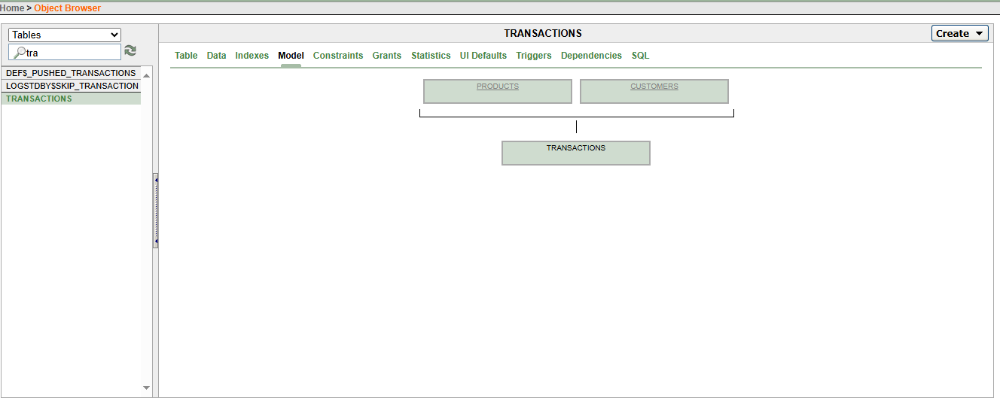

# 📘 README – Database Development with PL/SQL

## 👥 BENJAMIN NIYONGIRA

---

## 📌 Project Overview

This project demonstrates advanced analytical capabilities in Oracle **PL/SQL** using window functions to solve complex business problems related to coffee sales data analysis. The implementation focuses on deriving actionable insights from transactional data using five key analytical techniques

Our main tasks were:

1. Create tables with constraints.
2. Insert sample data.
3. Finding Top 5 products per region/quarter using RANK
4. Showing Running monthly sales totals using SUM() and  OVER()
5. Finding Month-over-month growth using LAG()/LEAD()
6. Customer quartiles → NTILE(4)
7.  3-month moving averages → AVG() OVER()

---

## 🗄 Database Design

We created four tables:

1. **Customers** – stores customers information
2. **Products** – stores products detail
3. **Transaction** – stores transaction made


### Constraints applied:

* **PRIMARY KEY**: `customer_id`, `product_id`, `transaction_id`
* **FOREIGN KEY**: links  Transaction to customers & product
* **NOT NULL**: mandatory fields like `customer_id`, `product_id`



---

## 🔍 Queries

### ✔ Table Creation

Implemented using **CREATE TABLE** with constraints.
Example:

```sql
CREATE TABLE products (
    product_id NUMBER PRIMARY KEY,
    name VARCHAR2(100),
    category VARCHAR2(50),
    price_per_kg NUMBER
);
```
creation of all tables 


### ✔ Sample Data Insertion

Data was added for testing using **INSERT INTO**.


**Product table**


**Customer table**


**Transaction table**


### ✔ task i did

We tested:

* **RANK()** → Assigns ranks within each partition (region/quarter).
  
This SQL query analyzes sales performance to identify the top 5 best-selling products in each region for each quarter


  
* **SUM() OVER()** → Running Monthly Sales Totals.

This SQL query analyzes monthly sales performance with a running total.

Groups transactions by month (YYYY-MM format)

Calculates total sales for each individual month


  
* **LAG()/LEAD()** → calculates month-over-month sales growth percentage
  
1. Month-over-Month Comparison:
   
Compares each month's sales with the previous month

Shows sales trends and growth patterns

2. Growth Percentage Calculation:
   
Calculates percentage change: ((current - previous) / previous) * 100

Positive percentage = growth, Negative percentage = decline

.PNG)
  
* **NTILE(4)** → performs customer segmentation by spending quartiles.

  1. Customer Spending Analysis:
     
Calculates total lifetime spending for each customer

Ranks customers from highest to lowest spenders

2. Quartile Segmentation:
   
Divides customers into 4 equal groups (quartiles) based on spending

Quartile 1 = Top 25% spenders

Quartile 4 = Bottom 25% spenders


* **AVG() OVER()** → calculates a 3-month moving average of sales.

  1. Smooths Out Volatility:
     
Reduces month-to-month fluctuations

Shows underlying trends by averaging over 3 months

2. Moving Average Calculation:
   
For each month, calculates average of that month + previous 2 months

Creates a "rolling" average that moves with time

%20OVER().PNG)

### ✔ runnable codes 

**1. Top 5 Products per Region/Quarter using RANK()**

```sql
SELECT region, quarter, product_name, total_sales, sales_rank
FROM (
    SELECT 
        c.region,
        TO_CHAR(t.sale_date, 'Q-YYYY') as quarter,
        p.name as product_name,
        SUM(t.amount) as total_sales,
        RANK() OVER (PARTITION BY c.region, TO_CHAR(t.sale_date, 'Q-YYYY') 
                     ORDER BY SUM(t.amount) DESC) as sales_rank
    FROM transactions t
    JOIN customers c ON t.customer_id = c.customer_id
    JOIN products p ON t.product_id = p.product_id
    GROUP BY c.region, TO_CHAR(t.sale_date, 'Q-YYYY'), p.name
)
WHERE sales_rank <= 5
ORDER BY region, quarter, sales_rank;
```

**2. Running Monthly Sales Totals using SUM() OVER()**

```sql
SELECT 
    TO_CHAR(sale_date, 'YYYY-MM') as month,
    SUM(amount) as monthly_sales,
    SUM(SUM(amount)) OVER (ORDER BY TO_CHAR(sale_date, 'YYYY-MM')) as running_total
FROM transactions
GROUP BY TO_CHAR(sale_date, 'YYYY-MM')
ORDER BY month;
```

**3. Month-over-Month Growth using LAG()**

```sql
WITH monthly_sales AS (
    SELECT 
        TO_CHAR(sale_date, 'YYYY-MM') as month,
        SUM(amount) as monthly_sales
    FROM transactions
    GROUP BY TO_CHAR(sale_date, 'YYYY-MM')
)
SELECT 
    month,
    monthly_sales,
    LAG(monthly_sales) OVER (ORDER BY month) as previous_month_sales,
    ROUND(((monthly_sales - LAG(monthly_sales) OVER (ORDER BY month)) / 
           LAG(monthly_sales) OVER (ORDER BY month)) * 100, 2) as growth_percentage
FROM monthly_sales
ORDER BY month;
```

**4. Customer Quartiles using NTILE(4)**

```sql
SELECT 
    c.customer_id,
    c.name,
    c.region,
    SUM(t.amount) as total_spent,
    NTILE(4) OVER (ORDER BY SUM(t.amount) DESC) as spending_quartile
FROM customers c
JOIN transactions t ON c.customer_id = t.customer_id
GROUP BY c.customer_id, c.name, c.region
ORDER BY total_spent DESC;
```

**5. 3-Month Moving Averages using AVG() OVER()**

```sql
WITH monthly_data AS (
    SELECT 
        TO_CHAR(sale_date, 'YYYY-MM') as month,
        SUM(amount) as monthly_sales
    FROM transactions
    GROUP BY TO_CHAR(sale_date, 'YYYY-MM')
)
SELECT 
    month,
    monthly_sales,
    AVG(monthly_sales) OVER (
        ORDER BY month 
        ROWS BETWEEN 2 PRECEDING AND CURRENT ROW
    ) as three_month_moving_avg
FROM monthly_data
ORDER BY month;
```

---

## 📊 Results

Advanced Analytics Implemented

✅ Ranking Analysis (RANK()) - Product performance

✅ Running Totals (SUM() OVER()) - Growth tracking

✅ Comparative Analysis (LAG()) - Performance benchmarking

✅ Segmentation (NTILE()) - Customer categorization

✅ Trend Analysis (AVG() OVER()) - Business forecasting

---

## ✅ Sumarry of project 

This analysis successfully transformed raw sales data into strategic intelligence, providing the coffee company with a comprehensive understanding of their business performance across products, regions, customers, and time periods. The implementation of advanced window functions has created a robust analytical foundation for data-driven decision making and sustainable business growth.

The company now possesses the analytical capability to make informed strategic decisions that will drive revenue growth, optimize operations, and enhance customer relationships.

---

